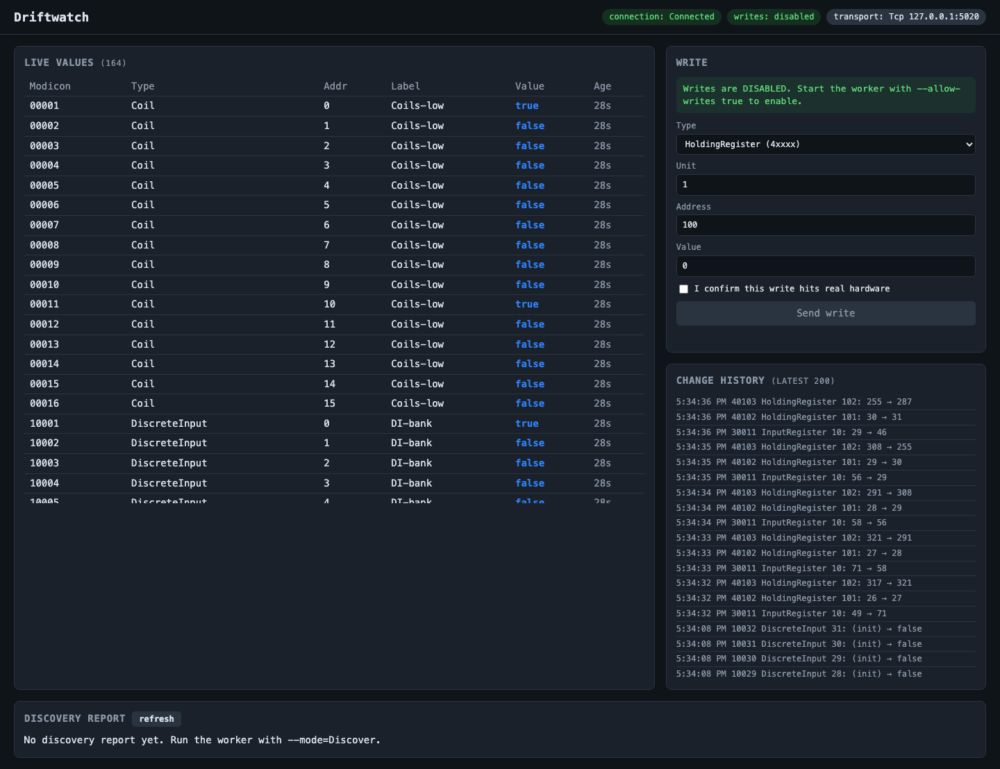
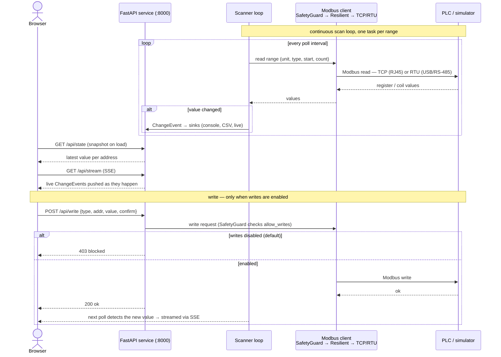

# Driftwatch — Modbus middleware + dashboard

A production-grade **Modbus client middleware** in Python that continuously scans a PLC's
registers, streams changes to a live web dashboard, logs them to CSV, and can discover an
unknown device's address map — plus a **simulator** so you can run the whole thing with no
hardware.

```
Browser ──▶ middleware service (FastAPI, :8000) ──Modbus TCP/RTU──▶ PLC
              scanner loop + dashboard UI + API                      ├─ real PLC  (production)
                                                                     └─ simulator (:5020, dev)
```



## How it works



## Features

- **Scan mode** — polls configured register ranges, emits an event only when a value changes.
- **Discover mode** — sweeps all four object types over an address range (optionally probing
  unit IDs first), writes a JSON Lines report of alive/dead addresses.
- **Live dashboard** — value grid, change history (SSE), discovery viewer, and a guarded write panel.
- **Transport-agnostic** — TCP or RTU (RS-485) behind one client interface; switch with a flag,
  no code change.
- **Resilient** — exponential-backoff reconnect, single retry on transport faults; protocol
  errors (e.g. illegal address) pass through without dropping the connection.
- **Safe by default** — writes are **blocked** unless explicitly enabled; the scanner/discovery
  never write.
- **Dead-address handling** — on `ILLEGAL_DATA_ADDRESS` the scanner bisects to the exact dead
  address(es) and stops re-polling them.
- **All four object types** + Modicon addressing (40101↔HR 100) + 32/64-bit decoding in all four
  word orders (ABCD/CDAB/BADC/DCBA).

## Quick start

**One command** (macOS/Linux):
```bash
./start.sh
```
**Windows:** double-click `start-windows.bat`.

First run installs dependencies, starts the simulator + service, and opens
**http://127.0.0.1:8000**. Press Enter at the PLC prompt to use the built-in simulator.

### Against a real PLC
```bash
PLC_HOST=192.168.1.50 ./start.sh                 # TCP, port 502
# or, manually:
cd middleware && .venv/bin/python -m driftwatch --mode scan \
  --host 192.168.1.50 --port 502 --unit 1
# RTU / RS-485:
... --mode scan --transport rtu --rtu-port /dev/ttyUSB0 --baud 9600
```

### Enable writes (reaches real hardware)
```bash
ALLOW_WRITES=1 ./start.sh        # or add --allow-writes
```

### Discover an unknown device
```bash
cd middleware && .venv/bin/python -m driftwatch --mode discover \
  --discovery-end 1000 --scan-slaves
```

## Run with Docker

```bash
docker compose up --build              # demo: simulator + middleware, dashboard on :8000
docker compose up --build middleware   # middleware only (point at a real PLC via env)
```

Reading a real device — set environment variables (see `docker-compose.yml`):

```bash
# RJ45 / Ethernet (Modbus TCP)
DW_HOST=192.168.1.50 DW_PORT=502 DW_UNIT=1 docker compose up --build middleware

# USB / RS-485 (Modbus RTU) — Linux hosts: also uncomment the `devices:` block in the compose file
DW_TRANSPORT=Rtu DW_RTU_PORT=/dev/ttyUSB0 DW_BAUD=9600 docker compose up --build middleware
```

- **RJ45/TCP**: on Linux, uncomment `network_mode: host` in `docker-compose.yml` for the simplest
  reachability to a PLC on your LAN.
- **USB/RTU**: device passthrough (`/dev/ttyUSB0`) works on **Linux** Docker. Docker Desktop on
  macOS/Windows can't pass a host serial port into a container — use `./start.sh` natively there.
- Change logs persist to `./data/logs/`. Writes stay disabled unless `DW_ALLOW_WRITES=true`.

## Manual setup (2 terminals)

```bash
# Terminal 1 — simulator (fake PLC, :5020)
cd plc-simulator
python3 -m venv .venv && .venv/bin/pip install -r requirements.txt
.venv/bin/python plc_sim.py --mode known

# Terminal 2 — middleware + dashboard (:8000)
cd middleware
python3 -m venv .venv && .venv/bin/pip install -e ".[dev]"
.venv/bin/python -m driftwatch --mode scan
```

## API

Served by the same process the dashboard uses:

| Endpoint | Purpose |
|----------|---------|
| `GET /api/state` | snapshot — latest value per address |
| `GET /api/stream` | SSE live change events |
| `GET /api/config` | transport, ranges, `allowWrites` |
| `GET /api/health` | connection state, last scan |
| `GET /api/discovery` | parsed discovery report (204 if none) |
| `POST /api/write` | write a Coil/HoldingRegister (gated; 403 when disabled) |

## Tests

```bash
cd middleware && .venv/bin/pytest        # 59 tests, in-memory fake client (no sockets)
```

## Configuration

Built-in defaults already define four demo ranges + console/CSV sinks. To customize, copy
`middleware/config.example.yaml` → `config.yaml` and run with `--config config.yaml`.
Precedence: defaults → YAML → `DW_*` env → CLI flags.

## Layout

```
plc-simulator/     Python Modbus server simulator (the test PLC)
middleware/        the product: client middleware + dashboard (one FastAPI service)
  driftwatch/  Clean Architecture layers (deps point inward):
    domain/           entities + value objects (object types, modicon, decoder, change event)
    application/      use cases + ports (scanner, discovery, ModbusClient/ChangeSink interfaces)
    adapters/         port impls (pymodbus transport, sinks, report writer)
    infrastructure/   FastAPI api, config loader, composition root (service)
  static/             dashboard UI
  tests/              pytest suite
start.sh, start-windows.bat        one-command launchers
setup-windows.*, verify-windows.bat
docker-compose.yml                 demo (simulator + middleware) + real-device options
  middleware/Dockerfile, plc-simulator/Dockerfile
```

## Docs

- **[RUNNING.md](RUNNING.md)** — full run guide + how to use the dashboard + troubleshooting.
- **[DEVELOPMENT.md](DEVELOPMENT.md)** — architecture, invariants, commands.

## Requirements

Python 3.9+. Dependencies (`pymodbus`, `fastapi`, `uvicorn`, `pyyaml`) install automatically on
first run. RTU on macOS needs `socat` for a virtual serial pair.

## Safety

Writes move real actuators. They are disabled by default and gated by a safety guard plus a
per-write confirm. Leave writes off until you have deliberately reviewed the target. There is no
auth on the dashboard — it binds to loopback; do not expose it to a network without your own
access control.
